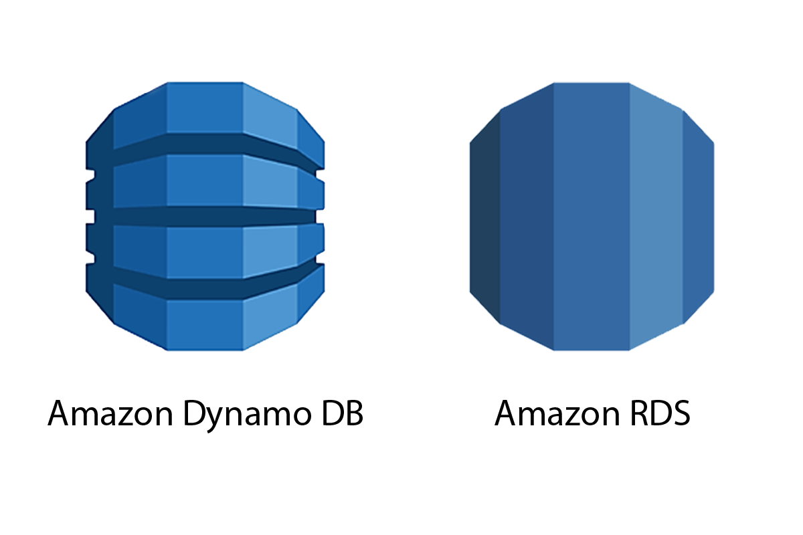
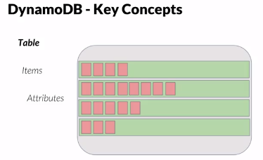
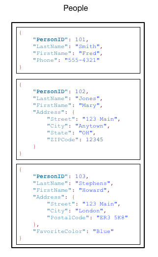
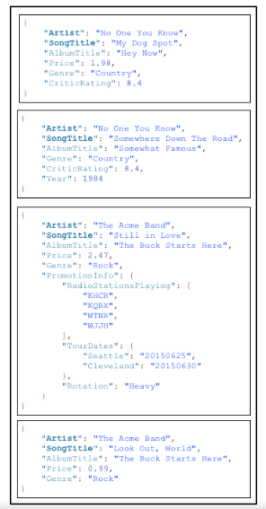
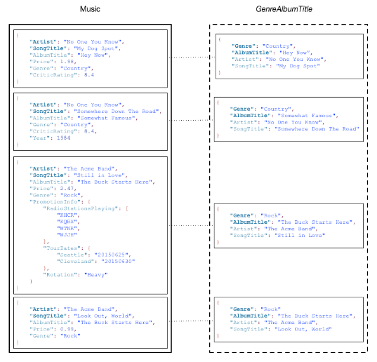
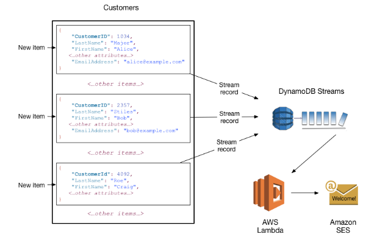

  <h1> Databases on AWS </h1>

  

## Table of Contents
- [Relational Database Service Features (RDS)](#relational-database-service-features)

- [DynamoDB Features](#dynamodb-features)

- [Core Components of Amazon DynamoDB](#core-components-of-amazon-dynamodb)
  - Tables, Items, and Attributes
  - Primary Key
  - Secondary Indexes
  - DynamoDB Streams

- [Consistency](#consistency)

- [References](#references)

# Relational Database Service Features

    1. We have compatibility with 6 database engines, such as:
        - Amazon Auora
        - MySQL
        - MariaDB
        - PostgreSQL
        - Oracle
        - Microsoft SQL Server
    
    2. Automatic Backups: They're base on a period of retention. When we talk about period of retention, we mean that we can have the historical data of our DB from a range within 1-35 from the past days. We can also specify the hour, minute, second we want to get the db restoring done.

    IMPORTANT: Check default value set for the period of retention.

    3. Manual Backups: We can control the exact time we want the backup to be build at. When we perform a manual backup, AWS creates a snapshot from the DB with the data in the provided time. In the same order, we can get a snapshot whe we delete a DB.

    4. Storage: They've got a storage system that through which we can select from 2 different types of storage: 
        - General Purpose (SSD): Basically, it thought to be implemented to any database with a very constant read/write load. Certainly, it can support a fragment of high read/write processing but, this is not originally the use case behind the db operations.

        - Provisioned (SSD): We require a db with high disk consumption, high read/write operations. It is thought to be used for intensive use of Input/Output operations.

    ¿What is the difference between both of them?
        Performance and the amount of IOPS(stands for Inputs Outputs Per Second. It is a common method of measuring the performance of hard drives, such as SATA , SAS, and SSD. IOPS is concerned with determining how fast a hard drive can read and write data. Can be used for both traditional 'spinning' drives and Solid State Drives (SSD)), and pricing.

        On the provisioned you can select the amount of IOPS, unlike the general purpose which comes with a predetermined amount. 

    5. Security: At the information encryption level contained in our database, we can enable the data encryption through KMS service. We can create a encryption key, and specify the role that can have access to use and manage it.

    Another security feature is that we can make deployments inside VPC's within our network, and at the network level we can specify security groups through which we can specify source traffic and its protocol, and we ca define rules at the sub-network level using Network Access Control List to control traffic.

    6. Updates: RDS is a completely managed service. What does it mean? It means that the operational load that we are going to have as users is going to be reduced because AWS is going to perform many database administration loads, one of the is: upgrading the db engine, the only configuration we do is to specify the spacing in time that AWS counts to perform those upgradings. 

We can use our databe in integration with other services such as: 

- IAM (Identity and Access Management): Service in charge of the control and management of users, roles, and policies in AWS.

¿How does it work?
    This integration is made by tokens to connecto to the database. It is only allowed 10 to 20 connections per second, which is preferably thought to be used in development environments.

- Monitoring: Enhanced monitoring (Not available for small instances)

- Pricing: Depends on the storage, size of the instance, monitoring and extra configurations (deployments in differents regions, read-replicas, etc)

  <small> 
    <a href="#table-of-contents">
      🡡 back to top 
    </a> 
  </small>

# DynamoDB Features

    Amazon DynamoDB is a high-performance NoSQL database that supports key-value and document data models, and enables developers to build serverless applications. It is a managed service with strong consistency and predictable performance.

    1. It is a fully managed service: With a managed service, users only interact with the running application itself. You don’t need to worry about things like server health, storage, and network connectivity. With Amazon DynamoDB, AWS provisions and runs the infrastructure for you. Some of DynamoDB’s critical managed infrastructure features include: 
    
    - Automatic data replication over three availability-zones in a single region.
    - Infinitely scalable read-write I/O running on IOPS-optimized solid state drives.
    -A provisioned-throughput model where read and write units can be adjusted at any time based on actual application usage. 
    - Data backed up to S3.
    - Integrated with other AWS services like Elastic MapReduce (EMR), Data Pipeline, and Kinesis. 
    - Pay-per-use model – you never pay for hardware or services you’re not actually using.
    - Security and access control can be applied using Amazon’s IAM service. 
    - Great enterprise-ready features such as a robust SLA, monitoring tools, and private VPN functionality.

    2. Low-latency database.

    3. Has cache storage.

    4. Highly scalable: Being an AWS product, you can assume that Amazon DynamoDB will be extremely scalable. With their automatic partitioning model, as data volumes grow, DynamoDB spreads the data across partitions and raises throughput. This requires no intervention from the user.

    5. It is based on 2 main concepts:
        - Reading units (RCU): Composed by blocks of 4KB/sec.
        - Writing units (WCU): Composed by blocks of 1KB/sec.

        NOTE: It's important to have knowledge about this because when creating a new db we must specify the read/write capacity , and based on these 2 concepts is determined the pricing. Also, it becomes important when we have to define the scaling of the db and when creating a new table, because they determine the performance depending on the load we would have on that database.

For more information, check this blog on [Amazon DynamoDB: 10 Things You Should Know](https://cloudacademy.com/blog/amazon-dynamodb-ten-things/)

  <small> 
    <a href="#table-of-contents">
      🡡 back to top 
    </a> 
  </small>

# Core Components of Amazon DynamoDB

In DynamoDB, tables, items, and attributes are the core components that you work with. A table is a collection of items, and each item is a collection of attributes. DynamoDB uses primary keys to uniquely identify each item in a table and secondary indexes to provide more querying flexibility. You can use DynamoDB Streams to capture data modification events in DynamoDB tables.

## Tables, Items, and Attributes

  The following are the basic DynamoDB components:

  - Tables - Similar to other database systems, DynamoDB stores data in tables. A table is a collection of data. For example, see the example table called People that you could use to store personal contact information about friends, family, or anyone else of interest. You could also have a Cars table to store information about vehicles that people drive.

  - Items - Each table contains zero or more items. An item is a group of attributes that is uniquely identifiable among all of the other items. In a People table, each item represents a person. For a Cars table, each item represents one vehicle. Items in DynamoDB are similar in many ways to rows, records, or tuples in other database systems. In DynamoDB, there is no limit to the number of items you can store in a table.

  - Attributes - Each item is composed of one or more attributes. An attribute is a fundamental data element, something that does not need to be broken down any further. For example, an item in a People table contains attributes called PersonID, LastName, FirstName, and so on. For a Department table, an item might have attributes such as DepartmentID, Name, Manager, and so on. Attributes in DynamoDB are similar in many ways to fields or columns in other database systems.

  

  The following diagram shows a table named People with some example items and attributes.

  

Note the following about the _People_ table:
  - Each item in the table has a unique identifier, or primary key, that distinguishes the item from all of the others in the table. In the People table, the primary key consists of one attribute (PersonID).
  - Other than the primary key, the People table is schemaless, which means that neither the attributes nor their data types need to be defined beforehand. Each item can have its own distinct attributes.
  - Most of the attributes are scalar, which means that they can have only one value. Strings and numbers are common examples of scalars.
  - Some of the items have a nested attribute (Address). DynamoDB supports nested attributes up to 32 levels deep.

The following is another example table named Music that you could use to keep track of your music collection.

  

Note the following about the _Music_ table:

  - The primary key for Music consists of two attributes (Artist and SongTitle). Each item in the table must have these two attributes. The combination of Artist and SongTitle distinguishes each item in the table from all of the others.
  - Other than the primary key, the Music table is schemaless, which means that neither the attributes nor their data types need to be defined beforehand. Each item can have its own distinct attributes.
  - One of the items has a nested attribute (PromotionInfo), which contains other nested attributes. DynamoDB supports nested attributes up to 32 levels deep.

For more information, see [Working with Tables and Data in DynamoDB.](https://docs.aws.amazon.com/amazondynamodb/latest/developerguide/WorkingWithTables.html)

## Primary Key

When you create a table, in addition to the table name, you must specify the primary key of the table. The primary key uniquely identifies each item in the table, so that no two items can have the same key.

DynamoDB supports two different kinds of primary keys:

  - A simple primary key, composed of one attribute known as the _partition key_. 
  
  DynamoDB uses the partition key's value as input to an internal hash function. The output from the hash function determines the partition (physical storage internal to DynamoDB) in which the item will be stored.

  In a table that has only a partition key, no two items can have the same partition key value.

  The People table described in Tables, Items, and Attributes is an example of a table with a simple primary key (PersonID). You can access any item in the People table directly by providing the PersonId value for that item.

  - Partition key and sort key: 

Referred to as a composite primary key, this type of key is composed of two attributes. The first attribute is the partition key, and the second attribute is the sort key.

DynamoDB uses the partition key value as input to an internal hash function. The output from the hash function determines the partition (physical storage internal to DynamoDB) in which the item will be stored. All items with the same partition key value are stored together, in sorted order by sort key value.

In a table that has a partition key and a sort key, it's possible for two items to have the same partition key value. However, those two items must have different sort key values.

The Music table described in Tables, Items, and Attributes is an example of a table with a composite primary key (Artist and SongTitle). You can access any item in the Music table directly, if you provide the Artist and SongTitle values for that item.

A composite primary key gives you additional flexibility when querying data. For example, if you provide only the value for Artist, DynamoDB retrieves all of the songs by that artist. To retrieve only a subset of songs by a particular artist, you can provide a value for Artist along with a range of values for SongTitle.

_**NOTE**: The partition key of an item is also known as its hash attribute. The term hash attribute derives from the use of an internal hash function in DynamoDB that evenly distributes data items across partitions, based on their partition key values._

_The sort key of an item is also known as its range attribute. The term range attribute derives from the way DynamoDB stores items with the same partition key physically close together, in sorted order by the sort key value._

Each primary key attribute must be a scalar (meaning that it can hold only a single value). The only data types allowed for primary key attributes are string, number, or binary. There are no such restrictions for other, non-key attributes.

## Secondary Indexes

You can create one or more secondary indexes on a table. A secondary index lets you query the data in the table using an alternate key, in addition to queries against the primary key. DynamoDB doesn't require that you use indexes, but they give your applications more flexibility when querying your data. After you create a secondary index on a table, you can read data from the index in much the same way as you do from the table.

DynamoDB supports two kinds of indexes:

  - Global secondary index – An index with a partition key and sort key that can be different from those on the table.
  - Local secondary index – An index that has the same partition key as the table, but a different sort key.

  Each table in DynamoDB has a quota of 20 global secondary indexes (default quota) and 5 local secondary indexes per table.

In the example Music table shown previously, you can query data items by Artist (partition key) or by Artist and SongTitle (partition key and sort key). What if you also wanted to query the data by Genre and AlbumTitle? To do this, you could create an index on Genre and AlbumTitle, and then query the index in much the same way as you'd query the Music table.

The following diagram shows the example Music table, with a new index called GenreAlbumTitle. In the index, Genre is the partition key and AlbumTitle is the sort key.

  

Note the following about the _GenreAlbumTitle_ index:

- Every index belongs to a table, which is called the base table for the index. In the preceding example, Music is the base table for the GenreAlbumTitle index.

- DynamoDB maintains indexes automatically. When you add, update, or delete an item in the base table, DynamoDB adds, updates, or deletes the corresponding item in any indexes that belong to that table.

- When you create an index, you specify which attributes will be copied, or projected, from the base table to the index. At a minimum, DynamoDB projects the key attributes from the base table into the index. This is the case with GenreAlbumTitle, where only the key attributes from the Music table are projected into the index.

- You can query the GenreAlbumTitle index to find all albums of a particular genre (for example, all Rock albums). You can also query the index to find all albums within a particular genre that have certain album titles (for example, all Country albums with titles that start with the letter H).

For more information, see [Improving Data Access with Secondary Indexes.](https://docs.aws.amazon.com/amazondynamodb/latest/developerguide/SecondaryIndexes.html)

## DynamoDB Streams

DynamoDB Streams is an optional feature that captures data modification events in DynamoDB tables. The data about these events appear in the stream in near-real time, and in the order that the events occurred.

Each event is represented by a stream record. If you enable a stream on a table, DynamoDB Streams writes a stream record whenever one of the following events occurs:

- A new item is added to the table: The stream captures an image of the entire item, including all of its attributes.

- An item is updated: The stream captures the "before" and "after" image of any attributes that were modified in the item.

- An item is deleted from the table: The stream captures an image of the entire item before it was deleted.

Each stream record also contains the name of the table, the event timestamp, and other metadata. Stream records have a lifetime of 24 hours; after that, they are automatically removed from the stream.

You can use DynamoDB Streams together with AWS Lambda to create a trigger—code that runs automatically whenever an event of interest appears in a stream. For example, consider a Customers table that contains customer information for a company. Suppose that you want to send a "welcome" email to each new customer. You could enable a stream on that table, and then associate the stream with a Lambda function. The Lambda function would run whenever a new stream record appears, but only process new items added to the Customers table. For any item that has an EmailAddress attribute, the Lambda function would invoke Amazon Simple Email Service (Amazon SES) to send an email to that address.

  

_**NOTE**: In this example, the last customer, Craig Roe, will not receive an email because he doesn't have an EmailAddress._ 

In addition to triggers, DynamoDB Streams enables powerful solutions such as data replication within and across AWS Regions, materialized views of data in DynamoDB tables, data analysis using Kinesis materialized views, and much more.

For more information, see [Capturing Table Activity with DynamoDB Streams.](#https://docs.aws.amazon.com/amazondynamodb/latest/developerguide/Streams.html)

  <small> 
    <a href="#table-of-contents">
      🡡 back to top 
    </a> 
  </small>

# Consistency

Amazon DynamoDB is available in multiple AWS Regions around the world. Each Region is independent and isolated from other AWS Regions. For example, if you have a table called People in the _us-east-2 Region_ and another table named People in the _us-west-2 Region_, these are considered two entirely separate tables. For a list of all the AWS Regions in which DynamoDB is available, see [AWS Regions and Endpoints](https://docs.aws.amazon.com/general/latest/gr/rande.html#ddb_region) in the Amazon Web Services General Reference.

**Every AWS Region consists of** multiple distinct **locations called Availability Zones**. Each Availability Zone is isolated from failures in other Availability Zones, and provides inexpensive, low-latency network connectivity to other Availability Zones in the same Region. This allows rapid replication of your data among multiple Availability Zones in a Region.

When your application writes data to a DynamoDB table and receives an HTTP 200 response (OK), the write has occurred and is durable. The data is eventually consistent across all storage locations, usually within one second or less.

DynamoDB supports eventually consistent and strongly consistent reads.

  - _Eventually reading consistancy_: 
    - **Functionality**: When you read data from a DynamoDB table, the response might not reflect the results of a recently completed write operation. The response might include some stale data. If you repeat your read request after a short time, the response should return the latest data.
    - **Consumption**: 4KB of blocks per second.

  - _Strongly reading consistancy_:
    - **Functionality**: When you request a strongly consistent read, DynamoDB returns a response with the most up-to-date data, reflecting the updates from all prior write operations that were successful. However, this consistency comes with some disadvantages:
      - A strongly consistent read might not be available if there is a network delay or outage. In this case, DynamoDB may return a server error (HTTP 500).
      - Strongly consistent reads may have higher latency than eventually consistent reads.
      - Strongly consistent reads are not supported on global secondary indexes.
      - Strongly consistent reads use more throughput capacity than eventually consistent reads. For details, see [Read/Write Capacity Mode](https://docs.aws.amazon.com/amazondynamodb/latest/developerguide/HowItWorks.ReadWriteCapacityMode.html)
    - **Consumption**: 8KB of blocks per second.

    **NOTE**: DynamoDB uses eventually consistent reads, unless you specify otherwise. Read operations (such as _GetItem_, _Query_, and _Scan_) provide a _ConsistentRead_ parameter. If you set this parameter to true, DynamoDB uses strongly consistent reads during the operation.

  <small> 
    <a href="#table-of-contents">
      🡡 back to top 
    </a> 
  </small>

## References

https://docs.aws.amazon.com/dynamodb/index.html
https://docs.aws.amazon.com/amazondynamodb/latest/developerguide/HowItWorks.CoreComponents.html
https://cloudacademy.com/blog/amazon-dynamodb-ten-things/
https://www.tutorialspoint.com/dynamodb/index.htm

  <small> 
    <a href="#table-of-contents">
      🡡 back to top 
    </a> 
  </small>

